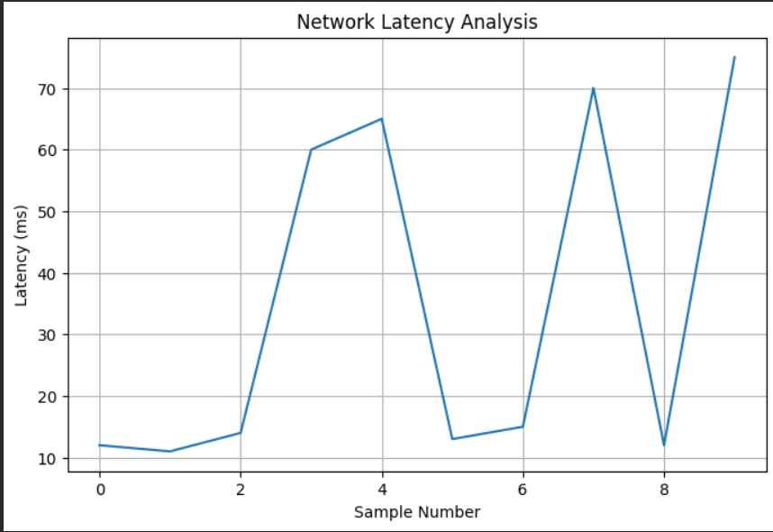

# Intelligent Network Monitoring Platform

## Overview

The Intelligent Network Monitoring Platform is a machine learning-powered network analytics solution designed to monitor network performance, detect anomalies, and provide actionable insights through data visualization.

The system analyzes critical network metrics such as latency, packet loss, throughput, and bandwidth utilization to identify abnormal behavior and support proactive network management.

---

## Key Features

* Real-time Network Performance Analysis
* Machine Learning-Based Anomaly Detection
* Latency Monitoring
* Packet Loss Analysis
* Throughput Tracking
* Bandwidth Utilization Monitoring
* Feature Importance Analysis
* Interactive Dashboard Support
* Data Visualization and Reporting

---

## System Architecture

Network Logs
↓
Data Collection
↓
Data Preprocessing
↓
Feature Engineering
↓
Machine Learning Model
↓
Anomaly Detection
↓
Visualization Dashboard
↓
Network Health Insights

---

## Technology Stack

### Programming Language

* Python

### Data Processing

* Pandas
* NumPy

### Machine Learning

* Scikit-Learn
* Random Forest Classifier

### Visualization

* Matplotlib

### Dashboard

* Streamlit

---

## Project Structure

Intelligent-Network-Monitoring-Platform

├── README.md

├── data

│ └── network_logs.csv

├── src

│ ├── generate_data.py

│ ├── anomaly_detection.py

│ ├── visualize.py

│ └── dashboard.py

├── results

│ ├── traffic_analysis.png

│ ├── feature_importance.png

│ ├── anomaly_detection.png

│ └── dashboard_preview.png

└── docs

└── Project_Report.md

---

## Results

### Network Latency Analysis

### Feature Importance Analysis

### Network Anomaly Detection

---

## Applications

* Enterprise Network Monitoring
* Cisco Network Operations
* Cloud Infrastructure Analytics
* Network Security Monitoring
* Wireless Communication Systems
* Data Center Performance Analysis

---

## Future Enhancements

* Real-Time Streaming Analytics
* Predictive Failure Detection
* Deep Learning-Based Traffic Classification
* Cloud Deployment
* Network Automation Integration
* Cisco Telemetry Integration

---

## Author

Sri Harshini S

Final Year Electronics and Communication Engineering Student

Areas of Interest:

* Wireless Communication
* Machine Learning
* Network Analytics
* Data Science
* Embedded Systems
